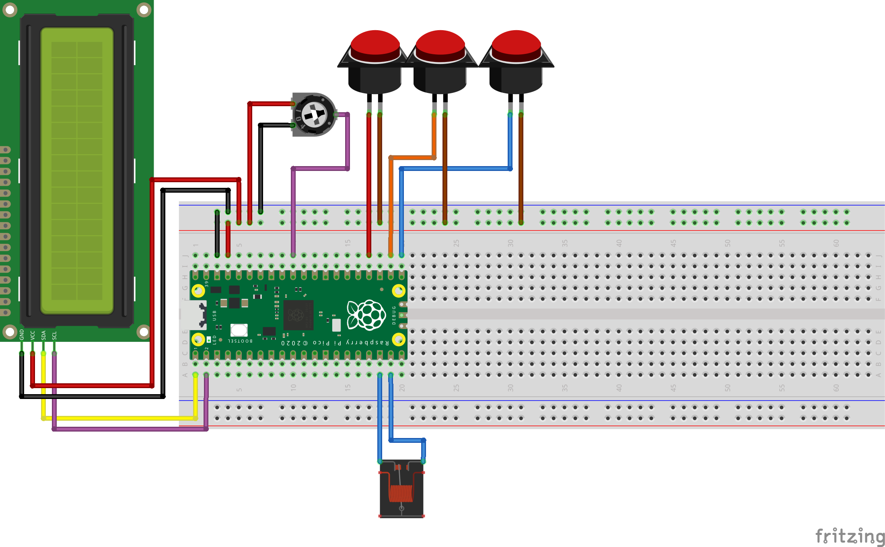

# Darkroom Timer

When connected to a potentiometer, standard LCD display, and three buttons to an
RP2040 chip, this embedded program runs a program to operate an enlarger (or,
practically, any powered relay) at precise intervals.

## Instructions

A time is displayed in the upper left. Pressing blue will add that time to the
sequence. Pressing red will remove the longest time from the sequence. Pressing
black will move into exposure mode. While in exposure mode, the display is not
backlit, so it is safe to take out your paper.

In exposure mode, the remaining exposure time is displayed in the upper left.
Pressing blue will start the next exposure step, which will stop automatically when it
reaches the next exposure interval.

When the total exposure time has elapsed, the device will go into a waiting mode
while you develop the image. Pressing blue and red simultaneously will reset to
the first step, turning on the display backlight.
